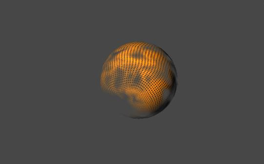
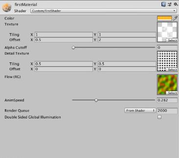
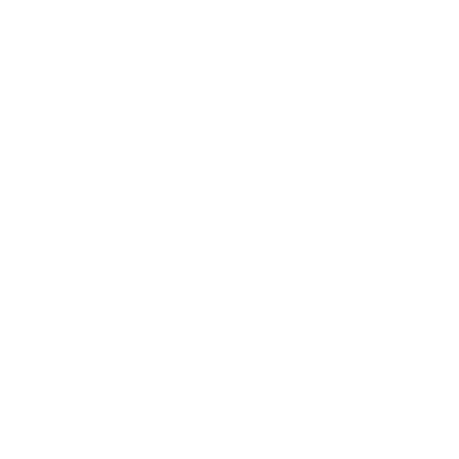

# INF1761-T4
## Geração de mesh no formato de esfera e criação de shader usando Unity e HLSL

### I - Geração de mesh
Um mesh é composto por uma lista de vertices e uma lista de triangulos, cada triangulo apontando para 3 vertices. Para poder mapear uma textura em cima de um mesh é necessario ter coordenadas de texturas, também chamadas coordenadas UV. Essas coordenadas são descritas em função dos vertices do mesh, por essa razão é preciso ter vertices duplicados ( tambem chamados de seams ) na "bordas" do mesh.


Isto é, se abrimos o nosso volume 3D de tal forma que possamos posicionar ele em um plano, os vertices situados no lugar da "costura" possuiriam as mesmas coordenadas no espaço. Temos então coordenadas mapeadas por pares de vertices, um com valor 0 e outro com valor 1.

Os cubos usados para gerar os exemplos a seguir são seamless, ou seja, eles não possuem nenhum vertice repetido. Esta condição necessita que a textura seja applicada atravez de um shader específico. 

Vale notar que estes cubos são composto por vários quads, desta forma, uma face possui n² vertices, n sendo o numéro de vertices em uma das suas arestas. 

#### A . Cubo projetado na superficie de uma esfera usando matemática
A primeira tecnica implementada consiste em projetar os vertices do cubo em um círculo de raio h/2 ( h = altura do cubo ). Para isso pegamos cada vertice do cubo e movemos ele na reta indo deste vertice até o centro do cubo de tal forma que sua distancia com o centro seja igual ao raio da esfera.


Maior o numero de vertices por faces, mais redonda fique a esfera:


Essa tecnica funciona razoavelmente bem, porem ela resulta em um mesh com uma repartição desigual dos vertices na sua superficie. As zonas mapeadas pelos vertices que eram das quinas do cubo possuem uma densidade de vertices maiores do que as mapeadas pelo centro das faces.

Por essa razão tentamos uma outra abordagem.

#### B . Cubo projetado na superficie de uma esfera usando física
Desta vez, em vez de projetar os vertices na superficie de uma esfera contida no cubo, vamos projetar os vertices em uma efsfera que contem o cubo. Para isso usando uma simulação do principio de electromagnetismo.
//TODO

### II - Criação de um shader com HLSL e Unity

#### A . Estrutura básica de um shader
HLSL + Unity tem uma syntaxe bastante parecida com a de C mas a organização do codigo é bastante differente.
```C
Shader "Custom/firstShader"
{
	Properties
	{
		//Propriedades que vão aparecer no inspector
	}
		SubShader
    {

        Pass {

        CGPROGRAM
        //Includes 

        //Variaveis globais

        //Funções
         ENDCG
		}
	}
}
```



A parte das propertie é onde definimos as variaveis que vão aparecer no inspector para poder modificar o shader sem precisar mexer no codigo.

```C

Properties
	{
		_Color("Color", Color) = (1, 1, 1, 1)
		
		_MainTex("Texture", 2D) = "white" {}
		_AlphaCutoff("Alpha Cutoff", Range(0, 1)) = 0.5
		_DetailTex("Detail Texture", 2D) = "white" {}

		[NoScaleOffset] _FlowMap("Flow (RG)", 2D) = "black" {}
		_AnimSpeed("AnimSpeed", Range(0, 1)) = 0.5
	}

```



Eu construi um shader com um unico subshader e pass.
Neste subshader eu implementei duas funções, uma de **vertex** e outra de **fragment**

```C
CGPROGRAM
	#pragma vertex MyVertexProgram
	#pragma fragment MyFragmentProgram

```
A saida do MyVertexProgram serve de entrada para MyFragmentProgram, essas duas funções são geralmente fusionada em uma função *surf* que modifica a superficie do mesh no geral.


#### B . Applicar uma textura e textura detalhada

Visualização das coordenadas de textura

```C
float4 MyFragmentProgram(Interpolators i ) : SV_TARGET
		{
			float4 albedo = tex2D(_MainTex, i.uv) * _Color;
			albedo *= tex2D(_DetailTex, i.uv * 10) * _Color * 2;
			return albedo;
		}
```


Sem textura de detalhe

Com texura de detalhe

#### C . Applicar uma luz
Ver o video
**Primeiro calculamos e representamos as normais**
As normais são calculadas no espaço do objeto, logo é preciso fazer uma transformação matricial para representar las em coordenadas do mundo.
```C
	i.normal = UnityObjectToWorldNormal(v.normal);
```

Podemos usar as coordenadas das normais como parametro de cores para representar las.
```C
	float4 MyFragmentProgram(Interpolators i ) : SV_TARGET
		{
			float4 normal = float4(i.normal * 0.5 + 0.5, 1);
			i.normal = normalize(i.normal);

			float4 albedo = tex2D(_MainTex, i.uv) * _Color;
			albedo *= tex2D(_DetailTex, i.uv * 10) * 2;

			return albedo * float4(light, 1);
}
```
Em seguida realizamos um produto escalar entre o vetor da direção da luz e as normais para poder representar a luz real
```C
	float4 MyFragmentProgram(Interpolators i ) : SV_TARGET
		{
			float3 lightDir = _WorldSpaceLightPos0.xyz;
			float4 normal = float4(i.normal * 0.5 + 0.5, 1);
			i.normal = normalize(i.normal);
			float3 light = DotClamped(lightDir, i.normal) * _LightColor0.rgb;

			float4 albedo = tex2D(_MainTex, i.uv) * _Color;
			albedo *= tex2D(_DetailTex, i.uv * 10) * _Color * 2;

			return albedo * float4(light, 1);
}

```

#### D . Aplicar transparencia
Para aplica a transparencia eu usei uma textura com um canal alpha variavel.



A ideia é bem simples, primeiro eu realizei um clamp a partir de um certo nivel de alpha. Tudo que estiver em um lugar aonde o alpha da textura esta abaixo de um certo nível tem alpha 0, o resto tem alpha 1. Este tipo de método permite obter um resultado bem "afiado" mas que não corresponde bem com o que eu queria. Para poder usar o alpha da minha textura como alpha da inha cor era preciso adicionar *Blend SrcAlpha OneMinusSrcAlpha* no inicio do meu pass.
Em seguida eu inseri o seguinte código:

```C
float GetAlpha(Interpolators i) {
	return _Color.a * tex2D(_MainTex, i.uv.xy).a;
}

MyFragmentProgram {
...
	float alpha = GetAlpha(i);
	albedo.a = alpha - _AlphaCutoff;
	clip(alpha - _AlphaCutoff);
...}
```

#### E . Usar FlowMap para criar um fluxo de distorção
Para animar uma textura em um shader basta mover a posição das coordenadas UV adicionando as com *_Time.y*


